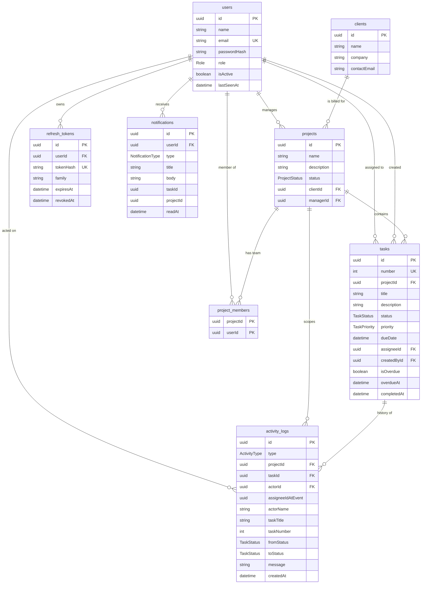

# Velozity Project Dashboard

A real-time client project dashboard for a small agency: three roles with strictly different
access, a live activity feed that is filtered per role, and a scheduled job that flags overdue
work. Built for the Velozity Global Solutions Full Stack Developer assessment.

**Stack** — React 19 + TypeScript (Vite) · Node + Express + TypeScript · PostgreSQL 16 + Prisma ·
Socket.io · node-cron · Zod · Tailwind CSS · Docker

| | |
|---|---|
| Repository | https://github.com/reflection-swarup/velozity-project-dashboard |
| CI |  |
| Live application | _not deployed yet — see [Deployment](#deployment)_ |
| Demo password | `Password123!` for every seeded account |

---

## Contents

- [Quick start](#quick-start)
- [Features](#features)
- [Demo accounts](#demo-accounts)
- [Tests](#tests)
- [Architecture](#architecture)
- [Roles and permissions](#roles-and-permissions)
- [Database schema](#database-schema)
- [Indexing decisions](#indexing-decisions)
- [Architectural decisions](#architectural-decisions)
- [How the real-time feed is filtered](#how-the-real-time-feed-is-filtered)
- [API reference](#api-reference)
- [Environment variables](#environment-variables)
- [Project layout](#project-layout)
- [Deployment](#deployment)
- [Known limitations](#known-limitations)
- [Explanation](#explanation)

---

## Quick start

### With Docker (recommended)

```bash
git clone https://github.com/reflection-swarup/velozity-project-dashboard.git
cd velozity-project-dashboard
cp .env.example .env          # then put two long random strings in the JWT secrets
docker compose up -d
```

Open **http://localhost:5173**. Cold start from an empty volume takes about 20 seconds.

Three containers come up in order, each gated on the previous one being healthy:

| Service | Port | Notes |
|---|---|---|
| `db` | 5433 → 5432 | Postgres 16, named volume, `pg_isready` health check |
| `api` | 4000 | runs `prisma migrate deploy`, then seeds, then starts |
| `web` | 5173 → 80 | production build served by nginx with SPA fallback |

Port 5433 is deliberate so the container does not collide with a Postgres already running on
5432. Nothing needs to be done by hand: the API entrypoint applies migrations and seeds the
database on first boot (`SEED_ON_START=true` in `docker-compose.yml`).

```bash
docker compose logs -f api                      # follow the API, including the cron sweep
docker compose exec api node dist/prisma/seed.js   # reset the demo data at any time
docker compose down -v                          # stop and delete the database volume
```

### Without Docker

Requires Node 20+ and a reachable PostgreSQL 16.

```bash
# 1. database only, if you want the container for it
docker compose up -d db

# 2. api
cd server
cp .env.example .env          # DATABASE_URL + two JWT secrets
npm install
npx prisma migrate deploy
npm run seed
npm run dev                   # http://localhost:4000

# 3. web, in a second terminal
cd web
cp .env.example .env          # VITE_API_URL=http://localhost:4000
npm install
npm run dev                   # http://localhost:5173
```

---

## Features

- **Three roles with genuinely different applications** — admin, project manager and developer,
  enforced server-side rather than hidden in the interface.
- **Projects and tasks** — clients, projects, and tasks with title, description, assignee, status
  (To Do / In Progress / In Review / Done), priority (Low / Medium / High / Critical), due date
  and a full activity history.
- **Live activity feed** — role-filtered over WebSockets, with the last 20 missed events replayed
  from the database when you come back.
- **Presence** — a live count of who is online right now, from socket presence.
- **Notifications** — stored in Postgres, delivered over the socket, with a count badge, a
  dropdown, and mark-one or mark-all-read. No polling anywhere in the client.
- **Overdue detection** — a scheduled sweep flags past-due work, posts it to the feed and
  notifies the assignee.
- **Shareable filters** — status, priority, due-date range and overdue-only all live in the URL.
- **Light and dark themes**, a landing page, and a responsive sidebar layout.

---

## Demo accounts

```
Admin             admin@velozity.test
Project Manager   ravi@velozity.test
Developer         karan@velozity.test

Password          Password123!
```

The landing page also has a **Continue as Admin / Project Manager / Developer** button for each
role, so there is nothing to copy or type to look around.

Every seeded account, all with the same password:

| Email | Role | What they can reach |
|---|---|---|
| `admin@velozity.test` | Admin | Everything, global feed, live online count |
| `ravi@velozity.test` | Project Manager | Northwind Storefront, Lumen Patient Portal |
| `neha@velozity.test` | Project Manager | Kanto Fleet Tracker, Northwind Loyalty |
| `karan@velozity.test` | Developer | Their 6 assigned tasks only |
| `sana@velozity.test` | Developer | Their assigned tasks only |
| `dev@velozity.test` | Developer | Their assigned tasks only |
| `meera@velozity.test` | Developer | Their assigned tasks only |

The seed creates 1 admin, 2 project managers, 4 developers, 3 clients, 4 projects, 21 tasks
across every status and priority, **2 already flagged overdue**, 67 activity log rows with
staggered timestamps and 29 notifications — so the feed and the unread badges are populated on
first load rather than empty.

**To see the real-time behaviour**, sign in as `karan@velozity.test` in one window and
`admin@velozity.test` in another, then change a task status as Karan. The admin feed updates with
no refresh. Sign in as `sana@velozity.test` as well: she receives nothing, because the task is not
hers.

---

## Tests

```bash
cd server
npm run typecheck        # tsc --noEmit, strict
npm run smoke            # 90 checks against a running API + WebSocket
npm run attack           # 24 adversarial checks, the pre-deployment checklist
npm run verify:overdue   # 7 checks on the scheduled job itself

cd ../web
npm run typecheck        # strict, noUncheckedIndexedAccess, noUnusedLocals
npm test                 # vitest unit tests
npm run build            # production build
```

`npm run smoke` needs the API running (`docker compose up -d` or `npm run dev`) and the seed
applied. It is idempotent — it restores every record it touches, so it can be run repeatedly.

All of it runs on every push through GitHub Actions (`.github/workflows/ci.yml`) in three jobs:
**web** (typecheck, unit tests, production build), **api** (typecheck, compile, migrate and seed
against a Postgres service container, verify the scheduler, boot the compiled server and run the
full smoke suite against it), and **docker** (both images build).

### What the smoke suite proves, mapped to the rubric

**Role-based access, enforced at the API (25%)**

| Check | Result |
|---|---|
| Developer cannot read another developer's task | `403` |
| Developer cannot change the title of their own task | `403`, and the record is re-read to confirm nothing changed |
| Developer cannot change priority or reassign their own task | `403` |
| Developer can change only the status of their own task | `200` |
| Developer cannot move another developer's task | `403` |
| Developer cannot delete a task, list users, list clients, or create a project | `403` |
| PM cannot read or edit another PM's project | `403` |
| PM cannot create users | `403` |
| PM cannot request another PM's project feed | `403` |
| Invalid / tampered JWT | `401` |
| No Authorization header on a protected route | `401` |
| Well-formed id for a record that does not exist | `404`, not `403` |
| Scope counts: admin sees 21 tasks, PM 11, developer 6 | every task the developer sees is assigned to them |
| **Developer cannot widen their scope with `?assigneeId=<other developer>`** | `403` |
| Developer filtering by a project outside their work still sees only their own tasks | scope holds |
| PM cannot list another PM's projects with `?managerId=<other pm>` | `403` |
| Developer cannot read the feed of a project they hold no tasks on | `403` |
| Tasks can only be assigned to users whose role is `DEVELOPER` | `400` |

**Real-time feed, role filtered, with catch-up (25%)**

| Check | Result |
|---|---|
| WebSocket handshake with a valid access token | connects |
| WebSocket handshake with a bad token | refused |
| A status change reaches the admin's global feed | received |
| The same change reaches the assigned developer | received |
| The same change reaches the owning PM | received |
| **An unrelated developer receives nothing** | no event within the timeout |
| Event text matches the required wording | `Karan Patel moved Task #12 from In Progress → In Review` |
| PM can join their own project room, but not another PM's | ack `true` / `false` |
| Developer is refused every project room by design | ack `false` |
| Offline catch-up returns missed events from the database | ≤ 20 rows, since the persisted `lastSeenAt` |
| Live online count reaches the admin | `presence:update` |
| PM gets a live notification when a task hits In Review | `notification:new` |
| Assigned developer gets a live assignment notification | `notification:new` |
| Unread count updates over the socket, never by polling | `notification:count` |
| Deactivating a user drops their open socket and tells it why | `session:revoked`, then disconnect |
| A deactivated user cannot reuse an unexpired access token, over HTTP or a new socket | `401` / handshake refused |

**Token handling**

| Check | Result |
|---|---|
| Refresh token is returned as an `HttpOnly` cookie scoped to `/api/auth` | verified from the `Set-Cookie` header |
| Refresh rotates the cookie | new value each time |
| Replaying a rotated refresh token is rejected | `401` |
| Reuse detection revokes the entire token family | the newly issued token is dead too |

**Validation and error shape**

Multi-value `status` / `priority` filters, `dueFrom`/`dueTo` ranges and `overdue=true` all apply;
invalid enum values, malformed UUIDs and empty update payloads return `422` with per-field
details; unknown routes return a structured `404`; no response contains a stack trace.

**Dashboards** — admin totals plus overdue count plus presence, PM projects and priorities and
this week, developer tasks sorted by priority then due date.

### The adversarial checklist

`npm run attack` is a separate script that attacks the API from the outside rather than
exercising happy paths, and is what I run before deploying. It restores everything it touches, so
it is safe to repeat.

| | Attack | Result |
|---|---|---|
| 1 | Developer lists tasks, then retries with `?assigneeId=<another developer>` | own tasks only, then `403` with nothing returned |
| 2 | Developer opens a project they hold no tasks on | `403` |
| 3 | Developer reads and moves another developer's task | `403` both |
| 4 | Developer reassigns their own task to someone else | `403`, and the assignee is re-read to confirm it is unchanged |
| 5 | Manager lists projects, reads another manager's project, filters by their id | own only, `403`, `403` |
| 6 | Developer moves a task while an admin, the owning manager and an unrelated developer all hold sockets | admin, assignee and manager receive it; the unrelated developer receives nothing |
| 7 | Catch-up endpoint | a `since` timestamp, at most 20 rows, scoped to the caller |
| 8 | Create a task already past its due date | not flagged by the API; existing overdue rows carry a timestamp |
| 9 | Inspect the refresh cookie, rotate it, then replay the old one | `HttpOnly`, path scoped, absent from the body, rotation works, replay `401` |

### The scheduled job

Raising the overdue flag belongs to the sweep alone. Creating a task with a past due date leaves
`isOverdue = false` until the next run, and an edit can only ever *clear* the flag — which is what
pushing the due date out or finishing the work should do straight away. That keeps the
responsibility in one place rather than split between the API and the scheduler.

`npm run verify:overdue` inserts a past-due task, runs the sweep directly, and asserts it flags
the task, persists `isOverdue` + `overdueAt`, writes exactly one activity row, notifies the
assignee, that **a second sweep is a no-op** (idempotent), that a future due date is never
re-flagged, and that the flag stays raised until an edit clears it.

The job was also verified end to end inside the container by inserting a past-due row straight
into Postgres — no API involved — and waiting for the cron to pick it up on its own:

```
planted 08:03:45   isOverdue = f
FLAGGED 08:05:04   ← the */5 tick, 75s later
  activity_logs   TASK_OVERDUE | System | Task #26 · Cron end to end task is overdue
  notifications   TASK_OVERDUE | Meera Nair | ...passed its due date
```

### Frontend unit tests

`web/npm test` covers the activity-cache scoping rule: TanStack Query matches keys by prefix, so
`['activity','feed']` also matches `['activity','feed','<projectId>']`. Without an explicit scope
check, an event from Project B would be prepended into a feed filtered to Project A. The tests
assert an event reaches the unfiltered feed and its own project's feed, and **never** a feed
scoped to a different project.

---

## Architecture

```
              React + TypeScript (Vite)
                        │
            in-memory access token, HttpOnly refresh cookie
                        │
                        ▼
              Express + TypeScript API
                        │
        ┌───────────────┼────────────────┐
        ▼               ▼                ▼
  requireAuth      requireRole     Zod validation
  (role read       (route gate)    (body/query/params)
   from the DB)
        │
        ▼
  role scope compiled into every WHERE clause
        │
        ├────────────► PostgreSQL 16 + Prisma
        │                    │
        │              append-only activity_logs,
        │              notifications, refresh_tokens
        │
        ├────────────► Socket.io rooms
        │              feed:global · feed:project:{id} · user:{id}
        │                    │
        │                    └──► live feed, presence, unread badge
        │
        └────────────► node-cron sweep
                       flags overdue work, writes to the feed
```

A request is authenticated, gated by role, validated, and then **narrowed by a role scope that is
part of the SQL** — so authorisation is not a check that can be forgotten, it is the shape of the
query. Writes persist their audit trail in the same transaction, and only then fan out over
WebSocket rooms whose membership was itself authorised server-side.

---

## Roles and permissions

| Feature | Admin | Project Manager | Developer |
|---|---|---|---|
| Users | Full | List only | — |
| Clients | Full | List only | — |
| Projects | All | Own | Assigned |
| Tasks | All | Own projects | Assigned |
| Task fields | All | All, own projects | Status only |
| Activity | Global | Own projects | Own tasks |
| Notifications | Own | Own | Own |
| Presence | Global count | — | — |

In detail:

| | Admin | Project Manager | Developer |
|---|---|---|---|
| Projects | all, full CRUD | create; read/edit/delete **only their own** | read-only, and only projects where they hold a task |
| Tasks | all | all tasks in their own projects | only tasks assigned to them |
| Task edits | every field | every field, own projects | **status only** — any other field is rejected with 403 naming it |
| Users | list, create, edit, deactivate | list only (to pick an assignee) | none |
| Clients | full CRUD | list only | none |
| Activity feed | global | their own projects | only events on their own tasks |
| Dashboard | totals, by status, overdue, **live online count** | own projects, by priority, due this week | own tasks by priority then due date |

Enforcement is layered, and none of it lives in the browser:

1. `requireRole(...)` on the route is the coarse gate.
2. A **scope filter is compiled into the `WHERE` clause** of every list query
   (`taskScopeFilter`, `projectScopeFilter`, `activityScope`). A developer's task query is
   structurally incapable of returning another developer's task — there is no fetch-then-check.
3. Ownership assertions guard single-record access (`assertProjectVisible`,
   `assertProjectManageable`).
4. `403` means it exists but is not yours; `404` means it does not exist.

### Why a modified token cannot escalate

The brief asks specifically that a Developer cannot reach a Project Manager's data by hitting the
API with a modified token. Two independent layers:

1. Editing a JWT breaks its HMAC signature, so `jwt.verify` rejects it — `401`.
2. Even with a validly signed token, **`requireAuth` ignores the `role` claim** and re-reads the
   role from the database on every request, along with `isActive`. The token proves *who* you
   are; the database decides *what* you are. Demoting or deactivating someone takes effect on
   their next request rather than when their token expires, and a role change also revokes their
   refresh tokens.

---

## Database schema

Eight tables. `users` sits at the centre; everything else hangs off `users` or `projects`.



Enums are real Postgres enums: `Role`, `TaskStatus`, `TaskPriority`, `ProjectStatus`,
`ActivityType`, `NotificationType`.

**`projects.managerId` is the ownership boundary.** A project manager's entire world is
`where managerId = me`, which is what makes their scope a single indexed predicate.

**`tasks.number`** is a sequence-backed integer, separate from the UUID primary key. It exists so
the feed can say "Task #12" as the brief requires, instead of exposing a UUID to a human.

**`tasks.priority`** is declared `LOW, MEDIUM, HIGH, CRITICAL` in that order, so Postgres sorts
`priority DESC` as Critical-first. The developer dashboard's required sort is therefore done by
the database rather than in JavaScript.

### The activity log

`activity_logs` is append-only and written **inside the same transaction** as the change it
describes, so it is stored rather than derived. Three deliberate denormalisations:

- `actorName`, `taskTitle` and `taskNumber` are copied onto the row, so rendering the feed needs
  no joins and history stays truthful after a rename or a deletion.
- `message` holds the finished sentence (`Ravi moved Task #12 from In Progress → In Review`), so
  the REST catch-up and the live socket event are byte-identical on screen. The client only adds
  the relative time.
- **`assigneeIdAtEvent`** records who owned the task at that moment. A developer's feed is
  "events on tasks assigned to me" — if it filtered on the task's *current* assignee, reassigning
  a task would retroactively hand the new developer the old developer's history. Recording
  ownership at event time keeps the developer feed both correct and a single indexed lookup.

---

## Indexing decisions

| Index | Query it serves |
|---|---|
| `users.email` unique | login lookup |
| `users(role)` | filtering the team list by role |
| `refresh_tokens.tokenHash` unique | every refresh is one point lookup |
| `refresh_tokens(userId, revokedAt)`, `(family)` | revoking a family on reuse detection |
| `tasks(projectId, status)` | project board and per-project status counts |
| `tasks(assigneeId, status)` | a developer's entire scope — the hottest query in the app |
| `tasks(priority, dueDate)` | the developer dashboard sort, with no extra sort step |
| `tasks(dueDate)`, `tasks(isOverdue)` | the cron predicate `dueDate < now AND isOverdue = false` |
| `tasks.number` unique | human-facing task reference |
| `activity_logs(createdAt DESC)` | the admin global feed |
| `activity_logs(projectId, createdAt DESC)` | the PM feed and any per-project feed |
| `activity_logs(assigneeIdAtEvent, createdAt DESC)` | the developer feed |
| `activity_logs(taskId, createdAt DESC)` | one task's history |
| `notifications(userId, readAt)` | the unread badge count |
| `notifications(userId, createdAt DESC)` | the notification dropdown |
| `projects(managerId)`, `(clientId)`, `(status)` | PM scope, client rollups, status filter |
| `project_members(userId)` | reverse lookup from a user to their projects |

The principle: **each feed variant has a composite index whose leading column is that role's
filter and whose second column is the sort order**, so every feed read is an index scan rather
than a scan-and-sort. The same reasoning drives `tasks(assigneeId, status)` and
`tasks(priority, dueDate)` — the role's predicate first, then the ordering the UI actually asks
for.

---

## Architectural decisions

### WebSockets: Socket.io, not native `ws`

The hard requirement here is not pushing bytes, it is **filtering by role**. Socket.io gives
rooms, acknowledgements and handshake middleware, and rooms are exactly the right primitive for
role-filtered broadcasting — with native `ws` I would have hand-rolled a room registry,
reconnection and heartbeats before writing any feature code. Acknowledgements also let the client
learn whether a room join was authorised, which the UI uses to label a developer's project feed
honestly.

`transports: ['websocket']` is pinned on both server and client, so the connection can never
silently fall back to HTTP long-polling. The brief treats polling as an auto-disqualification, so
this is asserted rather than assumed.

### Background jobs: node-cron, not Bull

The overdue sweep is one periodic `UPDATE` over an indexed predicate, not a queue of per-item
work with retries and backoff. Bull would mean adding Redis purely to schedule a query. node-cron
keeps the dependency surface at Postgres alone.

To make that choice safe rather than merely cheap, the job is written to be idempotent — it
selects only `isOverdue = false`, so a repeated or overlapping run flags nothing twice — and an
in-process guard stops a slow run from overlapping itself. The honest limitation is horizontal
scale: at more than one API instance every instance would run the sweep. Because the job is
idempotent the outcome stays correct, but the wasted work is real, and at that point the right
move is Bull with a Redis lock, or a Postgres advisory lock. This is listed under
[Known limitations](#known-limitations).

### Backend framework: Express, not Fastify

Socket.io attaches to the same HTTP server with no adapter, and per-route role guards are exactly
what Express's middleware chain expresses well (`requireAuth, requireRole('ADMIN'), validate(...)`
reads as the permission rule itself). Fastify is measurably faster at raw request throughput, but
nothing here is request-rate bound — the interesting cost is a WebSocket fan-out and a handful of
indexed queries.

### Token storage

| | Access token | Refresh token |
|---|---|---|
| Lifetime | 15 minutes | 7 days |
| Where it lives | **in memory** in React state | **`HttpOnly` cookie**, `Path=/api/auth` |
| Stored server-side | no, stateless JWT | yes, SHA-256 hash + family row |

The access token is never written to `localStorage` or `sessionStorage`, so XSS cannot read it out
of storage, and it expires in 15 minutes regardless. The refresh token is `HttpOnly`, so
JavaScript cannot touch it at all, and `Path=/api/auth` means the browser only ever ships it to
the three auth endpoints. On reload there is no token in memory, so the client calls
`POST /api/auth/refresh` once at boot and the cookie restores the session.

**Rotation with reuse detection.** Every refresh revokes the presented token and issues a new one
in the same `family`. Presenting an already-revoked token revokes **the whole family** and
refuses, so a stolen cookie is good for exactly one use — and that use logs both parties out and
leaves a trail. A `401` on any request triggers a single shared refresh attempt on the client
(deduplicated, so a burst of parallel requests cannot rotate the cookie more than once) and then
one retry.

### Validation and errors

Every route declares Zod schemas for `body`, `query` and `params`, validated before the
controller runs; query parameters are parsed and coerced into typed values by the same schema. A
single error handler converts `AppError`, `ZodError` and Prisma known-request errors into one
shape:

```json
{ "error": { "code": "FORBIDDEN", "message": "This project belongs to another manager" } }
```

Validation failures add `details` with a per-field path and message. In production an unexpected
error returns a generic message; stack traces are never sent to the client.

### Code organisation

Every domain is the same four files — `*.schemas.ts`, `*.service.ts`, `*.controller.ts`,
`*.routes.ts`. Controllers only do HTTP. Services hold the rules and own their transactions.
Access rules live in `*.access.ts` so the HTTP layer and the socket layer share one definition of
"can this person see this". There is no raw SQL in any controller; the only raw statement in the
codebase is a single `TRUNCATE ... RESTART IDENTITY` in the seed script, so a fresh seed starts at
Task #1.

---

## How the real-time feed is filtered

The naive approach — broadcast a project's events to everyone in that project's room — leaks one
developer's tasks to another. So **room membership is the filter**, and membership is authorised
on the server:

| Room | Who is in it |
|---|---|
| `feed:global` | admins, joined automatically on connect |
| `feed:project:{id}` | joined only via `project:subscribe`, and only for an admin or **that** project's manager |
| `user:{id}` | every user, their own |

**Developers never join a project room at all.** Their events arrive on their personal room, so
there is no code path by which another developer's task can reach them. That is a structural
guarantee rather than a filter someone has to remember to apply. The subscribe handler
acknowledges `true`/`false`, and the client uses that answer to label a developer's project feed
"Live · your tasks" instead of implying it sees everything.

One status change fans out as a **single chained emit** — global room, project room, the manager's
personal room, the assignee's personal room. Socket.io de-duplicates across rooms, so a PM who is
both in the project room and their own room receives it exactly once.

The REST feed uses the mirror-image scope, so a reload shows the same thing the socket would have
pushed: admin unfiltered, PM `project.managerId = me`, developer `assigneeIdAtEvent = me`.

**Presence** is an in-memory `userId → Set<socketId>` map, so a user with three tabs counts once
and only goes offline when the last socket closes. Changes broadcast to `feed:global`, which is
what keeps the admin's "online right now" live.

**Offline catch-up.** When a user's last socket disconnects the server persists `lastSeenAt`. On
return, `GET /api/activity/missed` reads up to 20 events created after that timestamp **from the
database** with the same role scope applied — nothing is cached in memory, as the brief requires.
The UI surfaces them as a "N updates while you were away" banner.

---

## API reference

Base `http://localhost:4000`, everything under `/api`. Protected routes need
`Authorization: Bearer <accessToken>`.

### Auth

| Method | Path | Access |
|---|---|---|
| POST | `/api/auth/login` | public — `{ email, password }`, sets the refresh cookie |
| POST | `/api/auth/refresh` | public via cookie, rotates it |
| POST | `/api/auth/logout` | revokes the family, clears the cookie |
| GET | `/api/auth/me` | any signed-in user |

### Users and clients

| Method | Path | Access |
|---|---|---|
| GET | `/api/users?role=&search=` | Admin, PM |
| POST | `/api/users` | **Admin** |
| PATCH | `/api/users/:id` | **Admin** — role change or deactivation revokes refresh tokens |
| GET | `/api/clients` | Admin, PM |
| POST · PATCH · DELETE | `/api/clients[/:id]` | **Admin** — delete is `409` while projects remain |

### Projects

| Method | Path | Access |
|---|---|---|
| GET | `/api/projects?status=&clientId=&managerId=&search=` | all roles, scoped |
| GET | `/api/projects/:id` | all roles, scoped |
| POST | `/api/projects` | Admin, PM (a PM's project is forced to themselves) |
| PATCH · DELETE | `/api/projects/:id` | Admin, owning PM — only an Admin may reassign `managerId` |
| POST | `/api/projects/:id/members` | Admin, owning PM |
| DELETE | `/api/projects/:id/members/:userId` | Admin, owning PM |

### Tasks

| Method | Path | Access |
|---|---|---|
| GET | `/api/tasks` | all roles, scoped — see filters below |
| GET | `/api/tasks/:id` | all roles, scoped |
| GET | `/api/tasks/:id/activity` | all roles, scoped |
| POST | `/api/tasks` | Admin, PM on their own project |
| PATCH | `/api/tasks/:id` | Admin/PM full edit; **Developer: `status` only** |
| PATCH | `/api/tasks/:id/status` | Admin, PM, assigned Developer |
| DELETE | `/api/tasks/:id` | Admin, PM on their own project |

Filters, all shareable in a URL: `projectId` · `assigneeId` · `status=TODO,IN_REVIEW` ·
`priority=CRITICAL,HIGH` · `dueFrom=` / `dueTo=` (ISO) · `overdue=true|false` · `search=` ·
`sort=priority|dueDate|createdAt|status` · `order=asc|desc` · `limit` (1–100) · `cursor`.
Returns `{ items, nextCursor, total }`.

### Activity, notifications, dashboard

| Method | Path | Notes |
|---|---|---|
| GET | `/api/activity?limit=&cursor=&projectId=` | role-filtered; admin global, PM own projects, developer own tasks |
| GET | `/api/activity/missed?limit=` | events since `lastSeenAt`, from the database |
| POST | `/api/activity/seen` | stamps `lastSeenAt` |
| GET | `/api/notifications?limit=&unreadOnly=` | `{ items, unreadCount }` |
| PATCH | `/api/notifications/:id/read` · `/read-all` | own notifications only |
| GET | `/api/dashboard` | one endpoint, payload shaped by role, with a `role` discriminator |
| GET | `/health` | public |

### WebSocket

`ws://localhost:4000/socket.io`, `websocket` transport only. Handshake:
`io(url, { auth: { token: accessToken } })`.

Client → server: `project:subscribe(projectId, ack)`, `project:unsubscribe(projectId)`.
Server → client: `activity:new`, `task:changed`, `notification:new`, `notification:count`,
`presence:update`.

### Status codes

`401` missing, invalid or expired token · `403` authenticated but not permitted, including
exists-but-not-yours · `404` genuinely absent · `409` conflict · `422` validation failure with
per-field `details`.

---

## Environment variables

Nothing is hardcoded; the API validates its environment with Zod at boot and refuses to start on a
missing or too-short secret.

### `server/.env`

| Variable | Default | Notes |
|---|---|---|
| `NODE_ENV` | `development` | |
| `PORT` | `4000` | |
| `DATABASE_URL` | — | required |
| `JWT_ACCESS_SECRET` | — | required, min 16 chars |
| `JWT_REFRESH_SECRET` | — | required, min 16 chars, must differ from the access secret |
| `ACCESS_TOKEN_TTL` | `15m` | |
| `REFRESH_TOKEN_TTL_DAYS` | `7` | |
| `CORS_ORIGIN` | `http://localhost:5173` | comma-separated list allowed |
| `COOKIE_DOMAIN` | — | leave unset on localhost |
| `COOKIE_SECURE` | `false` | must be `true` in production |
| `COOKIE_SAMESITE` | `lax` | must be `none` when the API and web are on different domains |
| `OVERDUE_CRON` | `*/5 * * * *` | validated before the scheduler starts |
| `SEED_ON_START` | `false` | the Docker API sets this to `true` |

| `PUBLIC_API_URL` | — | the API's own public URL; set in production so the API can tell it is deployed cross-site |

### `web/.env`

| Variable | Default |
|---|---|
| `VITE_API_URL` | `http://localhost:4000` |

### Which file goes where

```
.env             JWT secrets, read by docker compose only
server/.env      the API: database url, secrets, cookie and CORS settings
web/.env         the web client: VITE_API_URL
```

Copy each one from the `.env.example` sitting beside it. The Postgres credentials in
`docker-compose.yml` (`velozity` / `velozity`) are **local development values, committed on
purpose** — they are not secrets, and nothing reads them in production, where the API takes a
single `DATABASE_URL` from its environment.

### Cookies in production

A cross-site deployment (web on Vercel, API on a WebSocket-capable host) needs all four of these
together:

```
CORS_ORIGIN=https://<your-web-domain>
PUBLIC_API_URL=https://<your-api-domain>
COOKIE_SECURE=true
COOKIE_SAMESITE=none
```

Getting this wrong produces the confusing failure where login succeeds and then a page reload
logs the user straight back out, because the browser silently refuses to store or send the
refresh cookie. So the API **validates the combination at boot and refuses to start** rather than
serving a session that cannot survive a refresh:

| Misconfiguration | Result |
|---|---|
| `COOKIE_SAMESITE=none` with `COOKIE_SECURE=false` | refuses to start — browsers drop the cookie |
| `NODE_ENV=production` with `COOKIE_SECURE=false` | refuses to start |
| `NODE_ENV=production` with a non-https `CORS_ORIGIN` | refuses to start |
| Web origin differs from `PUBLIC_API_URL` but `COOKIE_SAMESITE=lax` | refuses to start — the cookie would never be sent |

---

## Project layout

```
.
├── docker-compose.yml          db → api → web, each gated on a health check
├── server/
│   ├── prisma/
│   │   ├── schema.prisma       the whole data model
│   │   ├── migrations/         checked in, applied with migrate deploy
│   │   └── seed.ts             demo dataset
│   ├── scripts/
│   │   ├── smoke.mjs           74 checks against a live API + WebSocket
│   │   └── verify-overdue.ts   5 checks on the scheduler
│   └── src/
│       ├── config/env.ts       Zod-validated environment
│       ├── middleware/         auth (requireAuth, requireRole), validate, error
│       ├── modules/<domain>/   schemas | service | controller | routes | access
│       ├── realtime/           io.ts (handshake), rooms.ts, presence.ts, emit.ts
│       └── jobs/               scheduler.ts, overdue.job.ts
└── web/
    └── src/
        ├── auth/               in-memory access token, refresh on boot
        ├── realtime/           socket lifecycle, cache updates, feed scoping (+ tests)
        ├── hooks/              query keys and all server state
        ├── components/         layout (sidebar, topbar), ui primitives, feed, task views
        ├── pages/              landing, login, dashboards, projects, tasks, team, clients
        └── theme/              light/dark via semantic CSS tokens
```

---

## Deployment

The frontend is a static Vite build and deploys to Vercel directly:

```
Root directory:    web
Build command:     npm run build
Output directory:  dist
Environment:       VITE_API_URL = https://<your-api-host>
```

**The API cannot run on Vercel.** Vercel's serverless functions are request-scoped and terminate
after a response, so they cannot hold an open WebSocket connection — and the brief explicitly
rules out long-polling and SSE as substitutes. Putting the API there would mean abandoning the
requirement that carries 25% of the marks. So the API is deployed to a host that supports
long-lived connections (Render, Railway or Fly all work on a free tier) and Vercel serves the
frontend against it.

For a cross-domain deployment the API needs:

```
CORS_ORIGIN=https://<your-vercel-domain>
COOKIE_SECURE=true
COOKIE_SAMESITE=none
COOKIE_DOMAIN=<api domain>
```

`SameSite=None; Secure` is required for the browser to send the refresh cookie to a different
origin, and both must be set or the session silently fails to restore on reload.

---

## Known limitations

- **The overdue sweep assumes a single API instance.** It is idempotent, so correctness holds
  under concurrent runs, but on multiple instances every instance would do the same work. A Redis
  lock via Bull, or a Postgres advisory lock, is the fix.
- **Socket authorisation is revalidated on change, not continuously.** A socket is authorised at
  handshake; a role change or deactivation revokes the refresh tokens *and* disconnects that
  user's open sockets, forcing a fresh handshake that re-reads the role. Between those events the
  socket is not re-checked, so a production system would also want a short-lived socket session
  that must be renewed.
- **Presence is in-process.** The `userId → sockets` map lives in memory, so behind two instances
  the online count would only reflect one of them. The fix is the Socket.io Redis adapter, which
  also makes the room fan-out work across instances.
- **Catch-up granularity is one timestamp per user.** `lastSeenAt` is written when the last socket
  disconnects, so a user with two tabs closes one and keeps the other open without advancing it.
  Per-device cursors would be more precise.
- **The feed loads newest-first with a cursor**, not a live-tailing subscription with
  backpressure. At a much higher event rate the client would want to batch renders.
- **No rate limiting** on the auth endpoints. `express-rate-limit` on `/api/auth/login` would be
  the first thing to add before any real exposure.
- **The API Docker image is 581 MB.** Prisma's query and schema engines dominate it; the runtime
  stage already installs production dependencies only and runs as a non-root user.
- **The demo landing page hardcodes the seeded password** in its "Sign in as" buttons, which is
  deliberate for an assessment demo and the first thing to remove for real use.
- **Task deletion is hard, not soft.** Activity rows survive via `ON DELETE SET NULL` and the
  denormalised title, but the task row itself is gone.
- **The seeded logo is a single-tone PNG.** Dark mode inverts its lightness and rotates the hue
  back to keep the brand red; an SVG would render more sharply at high DPI.

---

## Explanation

*The hardest problem, how the real-time role-filtered feed works, and one thing I would do
differently.*

The hardest problem was role-filtering the live feed without ever trusting the client.
Broadcasting each project's events to everyone watching it leaks one developer's work to another,
and a filter applied after the fact is one someone can forget. So room membership became the
authorisation itself. Admins join a global room on connect; a project room is joined only through
an explicit subscribe that the server authorises against the database and acknowledges.
Developers are refused project rooms entirely and receive events on a personal channel, so no
path exists by which another developer's task reaches them. A status change fans out as one
chained emit across the global, project, manager and assignee rooms, which Socket.io
de-duplicates.

Two decisions followed. The activity log stores the finished sentence and the assignee at event
time, so REST catch-up and socket events render identically, and reassigning a task never hands
its history to someone new. The REST feed uses the mirror-image scope, so a reload shows exactly
what the socket would have pushed.

I would compose every role scope with `AND` from the start. I originally spread the scope and the
caller's filters into one object, which let `?assigneeId=<another developer>` overwrite the scope
rather than narrow it — a real vulnerability my tests missed because they never passed that
parameter. Scopes now combine so filters can only narrow, and regression tests attack it
directly.
